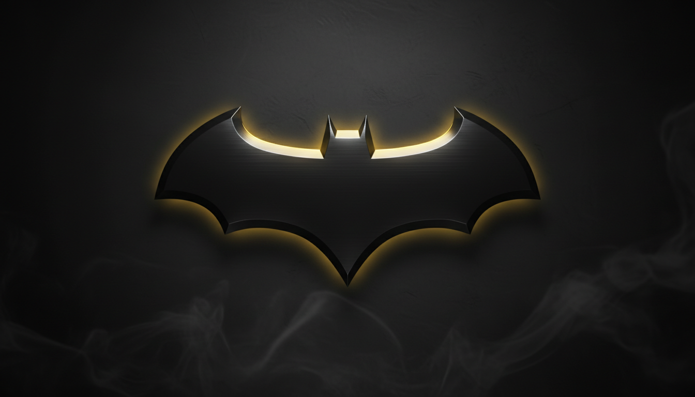

##
----
## Vehicle Preview

##
----
An autonomous vehicle designed for the Future Engineers category of the WRO 2026 that uses computer vision and IMU sensors to navigate complex environments and avoid obstacles intelligently.

## Content Structure

📁 **t-photos** → [team photos ](https://github.com/MohdAttili/BATMAN-TEAM/tree/main/t-photos)   
📁 **v-photos** → [vehicle photos  ](https://github.com/MohdAttili/BATMAN-TEAM/tree/main/v-photos)   
📁 **video** → [video.md with demonstration link  ](https://github.com/MohdAttili/BATMAN-TEAM/tree/main/videos)   
📁 **schemes** → [schematic diagrams ](https://github.com/MohdAttili/BATMAN-TEAM/tree/main/schemes)    
📁 **src** → [control software  ](https://github.com/MohdAttili/BATMAN-TEAM/tree/main/src)   
📁 **models** → [3D printing ](https://github.com/MohdAttili/BATMAN-TEAM/tree/main/models)    
📁 **other** → [documentation and additional resources  ](https://github.com/MohdAttili/BATMAN-TEAM/tree/main/other)   
## Project Overview
This repository contains all the engineering materials, code, schematics, and models related to our self-driven vehicle, designed and built to participate in the WRO Future Engineers 2025 competition. The project aims to develop an autonomous vehicle capable of navigating a predefined course while demonstrating precision, stability, and effective control of electromechanical components.

Our vehicle is a compact, versatile model incorporating both mechanical and electronic systems. It is designed to efficiently demonstrate autonomous navigation using sensors, motor control, and a central microcontroller. The design and implementation of this project involved detailed planning, testing, and iterative improvements to meet the strict requirements of the competition.
##
----
## Why BATMAN

**Our team is called “BATMAN”. We chose this name because Batman represents discipline, smart thinking, and courage. Like him, we face challenges, overcome difficulties, and work together to succeed. 🦇💪**

##
----
## Who We Are

<table border="1">
  <tr>
    <td align="center">
       
      |Osama Jadbah| 
      Research 
      Documentation
    </td>
    <td align="center">
       
      |Mohammad Attili| 
      Hardware  
      Software
    </td>
    <td align="center">
       
      |Kareem Amr| 
      Mechanical Design 
      Algorithms
    </td>    
  </tr>
</table>

We are a team of three passionate Palestinian students from Tulkarm Industrial Secondary School, united by our love for programming, artificial intelligence, and problem-solving. Osama Jadbah, 18, focuses on lifelong learning, self-development, and has earned multiple excellence certificates for his achievements. Mohammad Attili, 18, is a competitive programmer who has excelled in national and international contests, showcasing his innovation and tech skills. Kareem Amr, also 18, is a skilled programmer and problem solver, experienced in algorithms and competitive programming, and an accomplished chess player who earned 3rd place in the Palestinian Chess Championship. Together, we strive to develop our skills, tackle challenging projects, and explore new technological horizons.
[Further Information ](https://github.com/MohdAttili/BATMAN-TEAM/blob/main/t-photos/Team%20Description.pdf)

##
----

## 🔍 Project Description
**🎯 Goals**  
1. Build a functional self-driven vehicle that can navigate a course autonomously.  
2. Integrate electronic and mechanical components seamlessly.  
3. Develop modular and maintainable code to control all vehicle components.  
4. Document all aspects of the vehicle's design, construction, and programming.  
5. Provide clear and detailed engineering materials to facilitate understanding and replication.  
##
----
 ## ⚙️ Physical Equipment  

**1. 🧠 ESP32-WROOM-32 Overview**

1. ESP32-WROOM-32 is a powerful microcontroller by Espressif with built-in Wi-Fi and Bluetooth, featuring a dual-core 32-bit Xtensa LX6 processor up to 240 MHz, 520 KB SRAM, 4 MB Flash, and around 34 programmable GPIOs with multiple interfaces (SPI, I2C, UART, PWM, ADC/DAC).

2. It is widely used in robotics, IoT, smart home systems, and remote monitoring/control applications due to its dual connectivity, protocol support, large community, and ready-to-use libraries.   
##
----
**2.🎥 Pixy 2.1 (CMUcam5) Overview**

1. Pixy 2.1 is a smart vision sensor capable of detecting and tracking objects by color or shape, featuring a 320×200 resolution, up to 60 fps, multiple interfaces (SPI, I²C, UART, USB), and a built-in processor for real-time multi-object tracking.

2. It outputs object coordinates directly to microcontrollers such as Arduino or ESP32, reducing processing load, and is commonly used in line-following robots, object detection/sorting, interactive projects, and educational AI applications.
##
----
**3. ⚡ MG996R Servo Overview**

1. High-torque digital servo motor operating at 4.8–6.0V DC, delivering approximately 9.4–11 kg·cm torque, featuring a coreless motor and durable metal gears for smooth and precise motion.

2. Commonly used in steering systems, robotic arms, and hobby projects, controlled via standard PWM and compatible with Arduino, Raspberry Pi, and various robotics kits.
##
----
**4. 🚗 JGA52-370 12V Motor Overview**

1. 12V DC geared motor designed for smooth rotation and stable torque, featuring a 370-series motor with a high-precision metal gearbox that ensures durability and consistent speed under medium loads.

2. Widely used in robotics, electric locks, conveyor systems, and DIY mechanical projects, and can be easily controlled using motor drivers such as L298N or BTS7960, making it compatible with Arduino, microcontrollers, and automation systems.  
##
----
**5.🔥 AUG 22 Wires Overview**

1. 22-AWG stranded wires made of multi-strand copper with durable PVC insulation, designed for low-voltage DC circuits, offering flexible handling and stable current flow.

2. Commonly used for sensors, breadboards, prototyping, and lightweight robotics wiring, and are easy to strip, solder, and integrate with Arduino, Raspberry Pi, and general electronic modules.
##
----
**6.🤖 L298N Motor Driver Overview**

1. Dual H-bridge motor driver capable of controlling two DC motors or one stepper motor, operating on 5–35V DC with up to 2A per channel (with proper cooling), and featuring a built-in 5V regulator and heat sink for stable performance.

2. Commonly used in robotics, RC vehicles, CNC mechanisms, and motor-control projects, and easily integrated with Arduino, Raspberry Pi, and other microcontrollers using PWM for speed and direction control. 
##
----
**7.🧩 Metal Gear Set Overview**

1. Durable metal gear assortment designed for high-torque mechanical transmission, featuring multiple gear sizes and tooth counts to support different motor shafts and gear ratios.

2. Commonly used in robotics mechanisms, gearboxes, servo repairs, and custom motion-control projects, made from hardened metal for long life and easy integration with DC motors, servos, and DIY mechanical assemblies.
##
---- 
**8.🔧 M3 Screws Overview**

1. M3 metric screws with a 3 mm thread diameter, available in various lengths, made from stainless steel or hardened alloy to provide durable, corrosion-resistant, and reliable fastening.

2. Widely used for mounting motors, brackets, PCBs, 3D-printed parts, and structural frames, and fully compatible with nuts, washers, and standoffs in robotics kits, DIY projects, and precision assemblies.
##
---- 
**9 🛠 M4 Screws Overview**

1. M4 metric screws with a 4 mm thread diameter, available in multiple lengths, made from stainless steel or alloy steel to ensure high strength, durability, and corrosion resistance.

2. Commonly used for mounting metal brackets, motors, aluminum frames, and heavy-duty structures, and compatible with M4 nuts and washers in robotics, machinery, and DIY mechanical projects.
##
---- 
**10📏 MPU6050 Gyroscope Overview**

1. 6-axis motion sensor combining a 3-axis gyroscope and 3-axis accelerometer, operating at 3–5V, with a built-in DMP for real-time motion processing, ideal for drones, robotics, and motion-sensing projects.

2. I²C interface for easy communication, compatible with Arduino, Raspberry Pi, and microcontroller platforms, with libraries available for quick implementation and calibration.
##
---- 
**11👀 TOF 200C Overview**

1. High-precision Time-of-Flight (ToF) distance sensor operating at 3.3–5V, offering millimeter-level accuracy, ideal for obstacle detection, robotics navigation, automation, and gesture recognition.

2. Features a laser emitter and receiver, compact design, with I²C communication; compatible with Arduino, Raspberry Pi, and other microcontroller platforms.
##
---- 
**12👓TOF 400C Overview**

1. Advanced Time-of-Flight (ToF) distance sensor operating at 3.3–5V, capable of long-range measurements with millimeter-level accuracy, ideal for robotics, autonomous navigation, obstacle avoidance, and industrial automation.

2. Features a laser emitter and receiver for fast and reliable distance sensing, compact design, with I²C communication; compatible with Arduino, Raspberry Pi, and microcontroller platforms. (Quantity: 3 units)
##
---- 
**13📐 XH Connectors Overview**

1. Reliable XH series connectors with standard pitch and pin configuration, ensuring secure and stable low-voltage DC connections for battery packs, sensors, and small electronic modules.

2. Durable plastic housing with tin-plated contacts for corrosion resistance, easy to plug/unplug, compatible with JST-XH wires and headers for quick assembly and prototyping.
##
---- 
**14🖥 4.3” OLED Display Overview**

1. Compact 4.3-inch OLED screen with high-contrast, bright colors, wide viewing angles, and low power consumption, ideal for DIY electronics, robotics interfaces, handheld devices, and monitoring panels.

2. Integrated driver for easy control, thin and lightweight design, compatible with Arduino, Raspberry Pi, and other microcontroller platforms, supporting SPI/I²C communication. (Quantity: 2 units)
##
----
 [More Details about the Components](https://github.com/MohdAttili/TSISFE2025/blob/main/other/Selected%20Components.pdf)
 
 [Comparisons with Other Components in the Market](https://github.com/MohdAttili/TSISFE2025/blob/main/other/Comparison%20with%20Other%20Components.pdf) 
  

   
   
   
   
   
   
   
   
   
   
   
  
 

 ##
----
 ## 🎮 The Code 
 
 ## Robot Videos  
 <table border="1">
   <tr>
     <td align="center">
          
       <a href="Not ready yet" target="_blank">Open Challenge</a>
     </td>
     <td align="center">
        
       <a href="Not ready yet" target="_blank">Obstacle Challenge</a>
     </td>  
   </tr>
 </table>