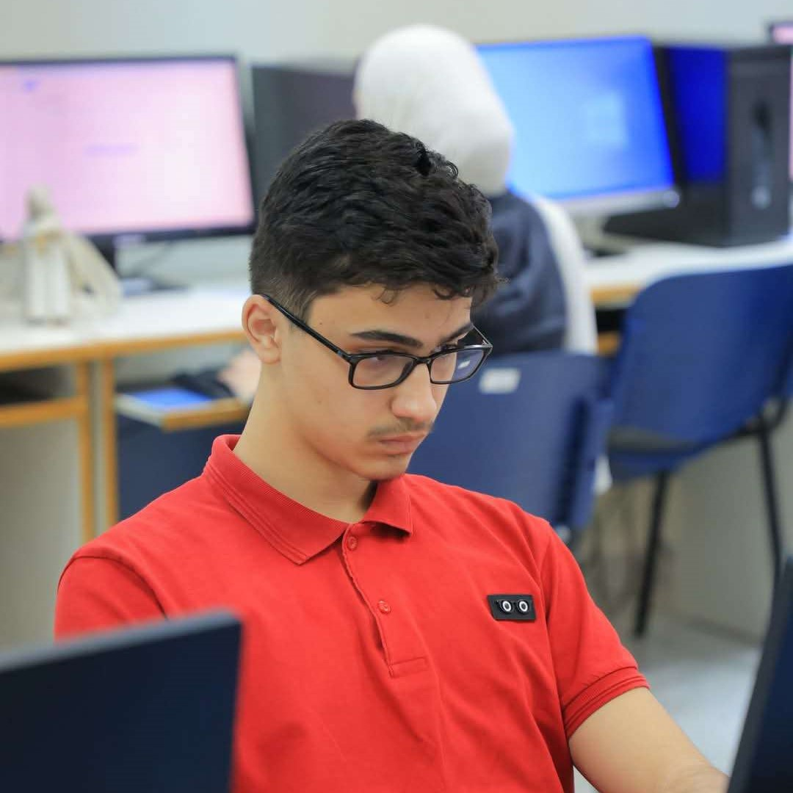
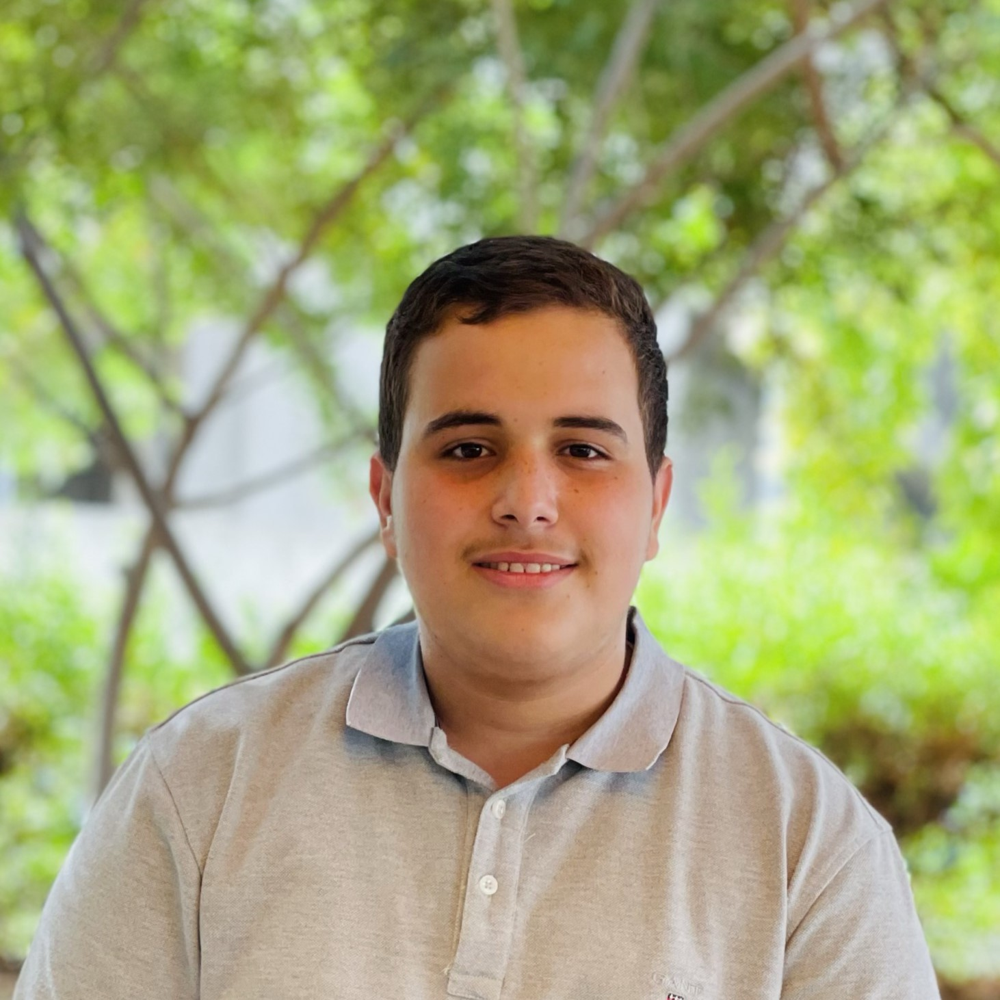
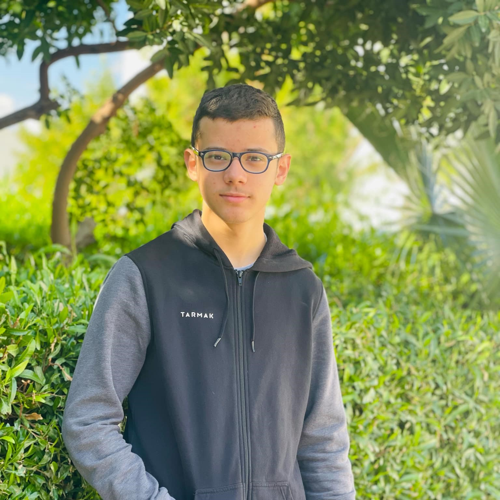

---

## Vehicle Preview

---
An autonomous vehicle designed for the Future Engineers category of the WRO 2025 that uses computer vision and IMU sensors to navigate complex environments and avoid obstacles intelligently.

## Content Structure

📁 **t-photos** → [team photos ](https://github.com/MohdAttili/TSISFE2025/tree/main/t-photos)   
📁 **v-photos** → [vehicle photos  ](https://github.com/MohdAttili/TSISFE2025/tree/main/v-photos)   
📁 **video** → [video.md with demonstration link  ](https://github.com/MohdAttili/TSISFE2025/tree/main/video)   
📁 **schemes** → [schematic diagrams ](https://github.com/MohdAttili/TSISFE2025/tree/main/schemes)    
📁 **src** → [control software  ](https://github.com/MohdAttili/TSISFE2025/tree/main/src)   
📁 **models** → [3D printing / laser cutting / CNC files ](https://github.com/MohdAttili/TSISFE2025/tree/main/models)    
📁 **other** → [documentation and additional resources  ](https://github.com/MohdAttili/TSISFE2025/tree/main/other)   
## Project Overview
This repository contains all the engineering materials, code, schematics, and models related to our self-driven vehicle, designed and built to participate in the WRO Future Engineers 2025 competition. The project aims to develop an autonomous vehicle capable of navigating a predefined course while demonstrating precision, stability, and effective control of electromechanical components.

Our vehicle is a compact, versatile model incorporating both mechanical and electronic systems. It is designed to efficiently demonstrate autonomous navigation using sensors, motor control, and a central microcontroller. The design and implementation of this project involved detailed planning, testing, and iterative improvements to meet the strict requirements of the competition.
## -------------------------------------------------------------------------------------
## Why TUREAH

**Our team is called "TUREAH" after the farming tool, symbolizing hard work, perseverance, and the ability to overcome obstacles. Just like the tool prepares the soil for growth, our team paves the way for success. 🌱**
## -------------------------------------------------------------------------------------

## Who We Are

<!-- 

 -->

<table border="1">
  <tr>
    <td align="center">
       
      Osama Jadbah 
      Planning  
      Research 
      Documentation
    </td>
    <td align="center">
       
      Mohammad Attili 
      Hardware  
      Software
    </td>
    <td align="center">
       
      Kareem Amr 
      Mechanical Design 
      Algorithms
    </td>    
  </tr>
</table>

We are a team of three passionate Palestinian students from Tulkarm Industrial Secondary School, united by our love for programming, artificial intelligence, and problem-solving. Osama Jadbah, an 11th-grade student, focuses on lifelong learning, self-development, and has earned multiple excellence certificates for his achievements. Mohammad Attili, 16, is a competitive programmer who has excelled in national and international contests, showcasing his innovation and tech skills. Kareem Amr, also 16, is a skilled programmer and problem solver, experienced in algorithms and competitive programming, and an accomplished chess player who earned 3rd place in the Palestinian Chess Championship. Together, we strive to develop our skills, tackle challenging projects, and explore new technological horizons.
[Further Information](https://github.com/MohdAttili/لBATMAN-TEAM/blob/main/t-photos/Team%20Description.pdf)
## -------------------------------------------------------------------------------------