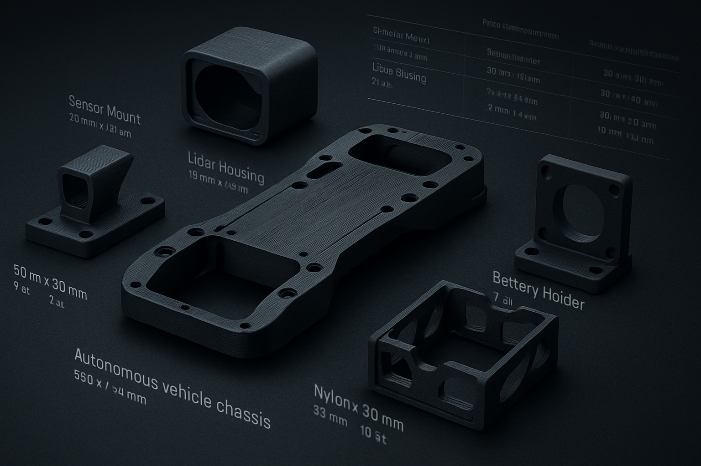

## This folder contains a number of 3D models that we printed to fit the pre-prepared chassis. It also includes the components used and a comparison table between them and other components available in the market.

<table>
  <tr>
    <td>
      
    </td>
    <td>
      

        <a href="https://github.com/MohdAttili/BATMAN-TEAM/blob/main/models/partsss/Steering_Bracket_2.stl">Steering_Bracket_2
        </a> 
        <a href="https://github.com/MohdAttili/BATMAN-TEAM/blob/main/models/partsss/diff%20house.stl">diff house
        </a> 
        <a href="https://github.com/MohdAttili/BATMAN-TEAM/blob/main/models/partsss/diff%20house2.stl">diff house2.
      </a> 
        <a href="https://github.com/MohdAttili/BATMAN-TEAM/blob/main/models/partsss/drive%20shaft.stl">drive shaft
      </a> 
        <a href="https://github.com/MohdAttili/BATMAN-TEAM/blob/main/models/partsss/front%20wheel%20con%20x2.stl">front wheel con 
      </a> 
        <a href="https://github.com/MohdAttili/BATMAN-TEAM/blob/main/models/partsss/left%20front%20wheel%20knuckle.stl">left front wheel knuckle
      </a>     
        <a href="https://github.com/MohdAttili/BATMAN-TEAM/blob/main/models/partsss/mainBoardCase.stl">mainBoardCase
      </a> 
        <a href="https://github.com/MohdAttili/BATMAN-TEAM/blob/main/models/partsss/rear%20wheels%20con%20x2.stl">rear wheels con 
      </a> 
        <a href="https://github.com/MohdAttili/BATMAN-TEAM/blob/main/models/partsss/rear%20wheels%20con2%20x2.stl">rear wheels con2 
      </a> 
        <a href="https://github.com/MohdAttili/BATMAN-TEAM/blob/main/models/partsss/right%20front%20wheel%20knuckle.stl">right front wheel knuckle
      </a> 
        <a href="https://github.com/MohdAttili/BATMAN-TEAM/blob/main/models/partsss/servo%20joint%20x2.stl">servo joint
      </a> 
        <a href="https://github.com/MohdAttili/BATMAN-TEAM/blob/main/models/partsss/servo%20pusher.stl">servo pusher
</a> 
    

    </td>
  </tr>
</table>
